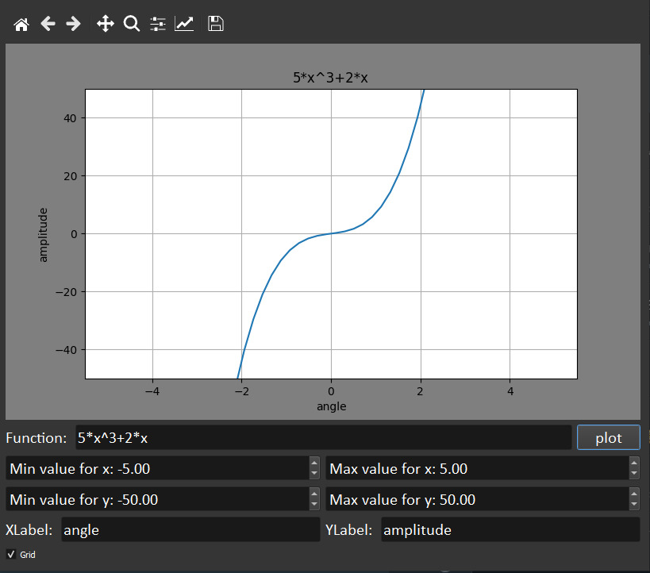

# Function Plotter

A GUI Program that plot an arbitary input function providing setting limits and labels
for axes x,y.
The following operators must be supported: + - / \* ^.

## Installation dependicies

you can install all dependicies project needs by

```bash
  pip install -r requirement.txt
```

## Examples





## Running Tests

To run tests, run the following command

```bash
  pytest testing.py
```

## Tests screenshot


